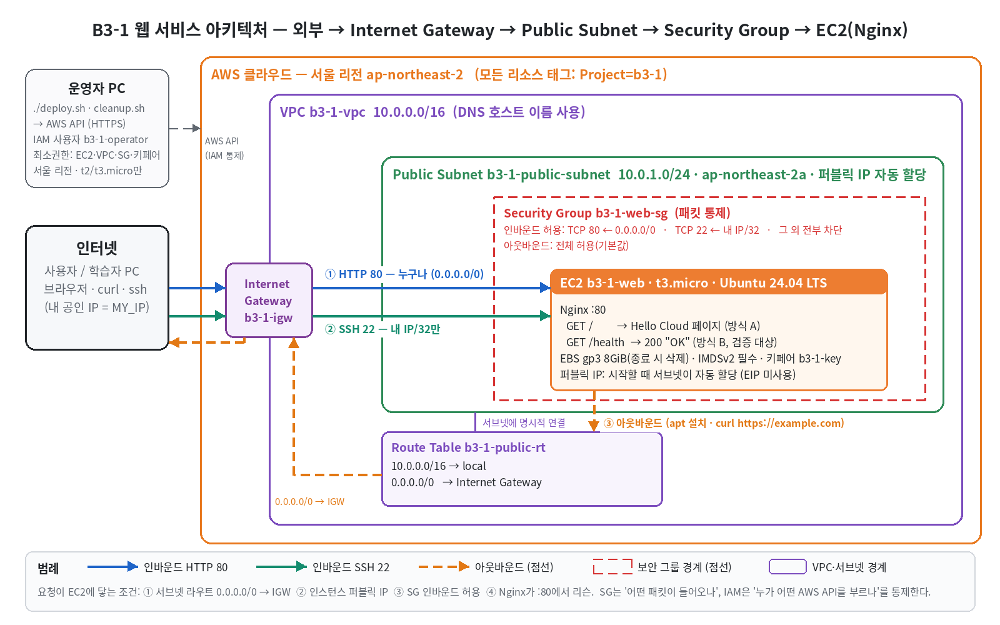

# B3-1 — AWS VPC·EC2·Nginx 웹 서비스 배포 자동화

> `.env`에 IAM 사용자 키 두 줄만 넣고 `./deploy.sh`를 실행하면 서울 리전에 VPC → Public Subnet → IGW → Route Table → Security Group → EC2(Nginx)가 만들어진다.
> 외부 접속 검증과 증거 저장도 함께 끝난다. 실습이 끝나면 `./cleanup.sh` 한 번으로 역순 삭제하고, 잔여 리소스 0건을 확인한다.

| | |
|---|---|
| 실행 | `./deploy.sh` → `./verify.sh` → `./cleanup.sh` |
| 리전 | 서울 `ap-northeast-2` (다른 값이면 중단) |
| 인스턴스 | `t3.micro`(기본) 또는 `t2.micro`, Ubuntu 24.04 LTS, EBS gp3 8GiB |
| 필요한 것 | Linux 또는 WSL의 Bash, `curl`, `ssh`. aws CLI v2는 없으면 `./.tools`에 자동 설치(sudo 불필요, `unzip` 필요) |
| 외부 접속 검증 | **방식 B — `GET http://<퍼블릭IP>/health` → 200 + `OK`** |

설계 결정은 [PLAN.md](PLAN.md), 과제 목표·평가 문항 답변은 [EXPLAIN.md](EXPLAIN.md)에 있다.

---

## AWS에서 직접 할 일 3단계

> 이 저장소의 스크립트·테스트·로컬 리허설은 끝나 있다. **AWS 계정에서 실행하는 일만 남았다.** (작성 과정에서 실제 AWS는 호출하지 않았다)

**1단계 — 키 넣기**

```bash
cp .env.example .env
# .env를 열어 두 줄만 채운다 (실습용 IAM 사용자의 액세스 키, 루트 키 금지)
#   AWS_ACCESS_KEY_ID=AKIA...
#   AWS_SECRET_ACCESS_KEY=...
```

IAM 사용자가 아직 없다면 → [IAM 사용자 만들기](#iam-사용자-만들기)

**2단계 — 배포하고 스크린샷 1장**

```bash
./deploy.sh
```

- 3~6분 뒤 `배포 완료` 상자에 나온 `http://<퍼블릭IP>/health`를 브라우저로 열어 `OK` 화면을 캡처한다 → `docs/screenshots/health.png`
- 아래 [외부 접속 검증](#외부-접속-검증--방식-b-선택) 표의 ⏳ 칸에 퍼블릭 IP를 적는다

**3단계 — 정리하고 스크린샷 1장**

```bash
./cleanup.sh
```

- `정리 완료: 잔여 리소스 0건`을 확인한다
- Billing 화면 또는 리소스 목록(EC2 terminated) 화면을 캡처한다 → `docs/screenshots/billing.png`
- [docs/cleanup-checklist.md](docs/cleanup-checklist.md)의 체크박스를 채운다

마지막으로 자동 생성된 `evidence/aws/*.txt`와 스크린샷을 커밋한다. 계정 ID와 내 IP는 증거 파일에서 자동으로 가려진다.

---

## 외부 접속 검증 — 방식 B 선택

| 항목 | 내용 |
|---|---|
| 선택한 방식 | **(B) `GET http://<퍼블릭IP>/health` 호출 → HTTP 200 + 고정 응답 `OK`** |
| 고른 이유 | 응답 코드와 본문이 고정이라 스크립트(`verify.sh`)가 PASS/FAIL을 기계적으로 판정하고 증거를 남길 수 있다. 같은 서버의 `/`(Hello Cloud 페이지)도 함께 확인하므로 방식 A도 동시에 성립한다 |
| 구성한 것 | ① Nginx `location = /health { return 200 "OK\n"; }` (`server/user-data.sh:45`) ② SG 인바운드 80 ← 0.0.0.0/0 ③ 서브넷 퍼블릭 IP 자동 할당 ④ 라우트 0.0.0.0/0 → IGW |
| 접속 정보 (URL) | ⏳ AWS 실행 후 기입 — `http://<퍼블릭IP>/health` |
| 퍼블릭 IP | ⏳ AWS 실행 후 기입 |
| 검증 결과 | ⏳ AWS 실행 후 기입 — `evidence/aws/04-verify.txt`의 결과 표 |
| 스크린샷 | ⏳ AWS 실행 후 추가 — `docs/screenshots/health.png` |

> 퍼블릭 IP는 실습이 끝나 정리하면 사라진다. 그래서 README의 IP는 "그때 이 주소로 접속했다"는 기록이고, 정리 후에는 접속되지 않는 것이 정상이다.

---

## 아키텍처



외부 요청이 웹 서버에 닿는 경로는 아래와 같다.

```
사용자 ──HTTP 80──▶ Internet Gateway ──▶ (VPC 10.0.0.0/16) Public Subnet 10.0.1.0/24 ──▶ Security Group(80 허용) ──▶ EC2 Nginx :80
EC2 ──(Route Table 0.0.0.0/0 → IGW)──▶ Internet Gateway ──▶ 인터넷   (apt 설치, curl https://example.com)
```

다이어그램은 [`docs/make_architecture.py`](docs/make_architecture.py)가 Pillow로 그린다(`python3 docs/make_architecture.py`).

## 생성 리소스

모든 리소스에 `Name=b3-1-…`, `Project=b3-1` 태그를 단다. 정리와 잔여 조회가 이 태그를 기준으로 한다.

| 리소스 | Name | 설정 | 만드는 곳 |
|---|---|---|---|
| VPC | `b3-1-vpc` | `10.0.0.0/16`, DNS 호스트 이름 사용 | `deploy.sh` `step_vpc` |
| Public Subnet | `b3-1-public-subnet` | `10.0.1.0/24`, `ap-northeast-2a`, 퍼블릭 IP 자동 할당 | `step_subnet` |
| Internet Gateway | `b3-1-igw` | VPC에 연결 | `step_igw` |
| Route Table | `b3-1-public-rt` | `0.0.0.0/0 → IGW`, 서브넷에 연결 | `step_route` |
| Security Group | `b3-1-web-sg` | 아래 규칙 표 | `step_sg` |
| Key Pair | `b3-1-key` | ed25519, `state/b3-1-key.pem`(400) | `step_keypair` |
| EC2 | `b3-1-web` | Canonical 최신 Ubuntu 24.04, IMDSv2 필수, user-data로 Nginx | `step_ami`, `step_instance` |
| EBS | `b3-1-root` | gp3 8GiB, 종료 시 삭제 | `step_instance` |

Elastic IP·NAT Gateway·ELB·RDS는 만들지 않는다.

## 보안 그룹 규칙

| 방향 | 포트 | 소스 | 허용 | 이유 |
|---|---|---|---|---|
| 인바운드 | TCP 80 | `0.0.0.0/0` | ✅ | 웹 서비스는 누구나 접속해야 한다(미션 요구) |
| 인바운드 | TCP 22 | `내 IP/32` | ✅ | 관리용 SSH는 나만. `.env`의 `MY_IP` 또는 자동 감지. 감지 실패 시 넓히지 않고 중단 |
| 인바운드 | TCP 22 | `0.0.0.0/0` | ❌ | 전 세계에서 무차별 대입 공격이 들어온다. 키가 새면 바로 침입 경로가 된다 |
| 인바운드 | TCP 443 | — | ❌ | HTTPS를 쓰지 않는다(보너스 범위). 쓰지 않는 포트는 열지 않는다 |
| 인바운드 | 0–65535 / 전체 프로토콜 | `0.0.0.0/0` | ❌ | 미션 금지 사항. 테스트가 `FromPort=0,ToPort=65535`·`IpProtocol=-1`이 없음을 확인한다 |
| 인바운드 | DB 포트(3306 등) | — | ❌ | DB가 없다. 있더라도 인터넷에 열지 않고 같은 VPC의 SG끼리만 허용한다 |
| 아웃바운드 | 전체 | `0.0.0.0/0` | ✅ (기본값) | user-data의 `apt-get`, 미션의 `curl https://example.com` 확인에 필요 |

## IAM 최소권한

실습 사용자 `b3-1-operator`에는 [`iam/least-privilege-policy.json`](iam/least-privilege-policy.json) 하나만 연결한다. `AdministratorAccess`는 쓰지 않는다.

| Statement | 효과 | 내용 |
|---|---|---|
| `ReadOnlyDescribe` | Allow | `ec2:Describe*` — 조회와 waiter(`wait instance-running` 등) |
| `LabLifecycle` | Allow | VPC·Subnet·IGW·Route Table·SG·키페어·인스턴스의 생성/연결/삭제와 `CreateTags`, 정리용 `DeleteVolume`·`DisassociateAddress`·`ReleaseAddress` |
| 두 Allow 공통 | 조건 | `aws:RequestedRegion = ap-northeast-2` — 다른 리전에서는 아무것도 못 한다 |
| `DenyNonFreeTierTypes` | Deny | `t2.micro`·`t3.micro`가 아닌 유형으로 `RunInstances` 금지 |

**들어 있지 않은 것**: S3·RDS·IAM·ELB 등 EC2 밖의 모든 서비스, `ec2:*`, EIP 할당(`AllocateAddress`), NAT Gateway 생성. `sts:GetCallerIdentity`는 권한 없이 항상 호출할 수 있어 넣지 않았다.
테스트 `test_iam_policy_covers_every_ec2_call_in_scripts`가 세 스크립트에 나오는 모든 `aws ec2 <작업>`이 이 정책으로 허용되는지 대조한다. 스크립트가 쓰지 않는 권한은 정책에 넣지 않는다.

### IAM 사용자 만들기

**방법 1 — 콘솔에서 직접 (루트 계정만 있을 때 권장)**

1. 루트로 콘솔에 로그인 → IAM → 정책 → 정책 생성 → JSON 탭에 `iam/least-privilege-policy.json` 내용 붙여 넣기 → 이름 `b3-1-least-privilege`
2. IAM → 사용자 → 사용자 생성 → 이름 `b3-1-operator` → (콘솔 접근이 필요하면) "AWS Management Console에 대한 사용자 액세스 권한 제공" 선택, 다음 로그인 시 비밀번호 재설정 체크
3. 권한 옵션: "직접 정책 연결" → `b3-1-least-privilege` 선택 (비밀번호 재설정을 켰다면 `IAMUserChangePassword`도 함께)
4. 만든 사용자 → 보안 자격 증명 → 액세스 키 만들기 → "CLI" → 키 두 개를 `.env`에 넣는다
5. 이후로는 루트를 쓰지 않는다. 콘솔은 `https://<계정ID>.signin.aws.amazon.com/console`로 `b3-1-operator`(또는 관리자 IAM 사용자)로 로그인한다

**방법 2 — 도우미 스크립트 (관리자 IAM 사용자가 이미 있을 때)**

```bash
./iam/create-iam-user.sh --profile my-admin            # ~/.aws의 관리자 프로필 사용
# 또는
ADMIN_AWS_ACCESS_KEY_ID=... ADMIN_AWS_SECRET_ACCESS_KEY=... ./iam/create-iam-user.sh --console
```

`b3-1-operator` 생성(있으면 재사용) → 정책 생성(있으면 재사용)·연결 → 액세스 키 발급 → `.env` 작성까지 한다. 기존 `.env`는 `.env.bak`으로 백업한다.
`--console`을 주면 무작위 초기 비밀번호를 한 번만 보여 주고, 첫 로그인 때 변경을 강제한다. 루트 키로 실행하면 거부한다.

---

## 스크립트 사용법

| 명령 | 하는 일 |
|---|---|
| `./deploy.sh` | 사전 점검 → 리소스 생성 → `/health` 200 대기(5초 간격 최대 5분) → 외부 검증 → 증거 저장 → 접속 정보 출력 |
| `./deploy.sh --preflight-only` | `.env`·aws CLI·자격 증명(루트 거부)·내 IP 확인까지만. 리소스를 만들지 않는다 |
| `./verify.sh` | 외부 `/health`·`/`, SSH로 `systemctl is-active nginx`·`curl localhost`·`curl https://example.com` 확인. 하나라도 실패하면 종료 코드 1 |
| `./verify.sh --wait` | `/health`가 200이 될 때까지 기다린 뒤 검증 (`deploy.sh`가 부른다) |
| `./cleanup.sh` | 역순 삭제 → 태그로 잔여 조회 → 0건이면 상태 파일을 `state/resources.cleaned-<시각>.env`로 보관 |
| `./iam/create-iam-user.sh` | (선택) 실습용 IAM 사용자와 `.env` 만들기 |

`.env` 선택 항목: `MY_IP`(비우면 자동 감지), `INSTANCE_TYPE`(`t3.micro`/`t2.micro`), `AZ`(기본 `ap-northeast-2a`), `PROJECT`(태그·이름 접두사, 기본 `b3-1`), `AWS_SESSION_TOKEN`(임시 키일 때).

### 사전 점검이 막는 것 (AWS 호출 전)

| 상황 | 결과 |
|---|---|
| `.env`가 없거나 키가 비어 있음 | 무엇을 채울지 안내하고 종료 코드 1. AWS를 한 번도 부르지 않는다 |
| 루트 계정 키 (`arn:aws:iam::<id>:root`) | 즉시 거부 — 미션 제약 "루트 금지" |
| 리전이 서울이 아님 / 프리 티어 외 인스턴스 유형 | 거부 |
| 내 IP 자동 감지 실패 또는 IPv4가 아님 | 22번을 넓게 열지 않고 중단, `MY_IP`를 직접 넣으라고 안내 |

### 재실행과 실패 시 동작

- 각 단계는 만든 리소스 ID를 **즉시** `state/resources.env`에 적는다. 다시 실행하면 이미 끝난 단계(생성·연결·규칙 추가)는 건너뛰고 이어서 진행한다.
- 실패하면 `[ERROR] 단계 실패: <단계>. 원인을 고친 뒤 ./deploy.sh를 다시 실행하면 이어서 진행합니다. 정리는 ./cleanup.sh`가 나온다.
- `cleanup.sh`는 상태 파일 값과 `Project=b3-1` 태그 조회 결과를 **합쳐** 지운다. 상태 파일을 잃어버려도 정리된다. 한 단계가 실패해도 경고만 남기고 다음 단계로 간다. 남은 리소스가 있으면 목록을 보여 주고 종료 코드 1로 끝난다(여러 번 실행해도 안전).

### 증거 파일 (AWS 실행 시 자동 생성)

| 파일 | 내용 |
|---|---|
| `evidence/aws/00-identity.txt` | 실행 주체 ARN(계정 ID 가운데 4자리 마스킹), 리전, SSH 허용 소스(내 IP 뒤 두 자리 마스킹) |
| `evidence/aws/01-network.txt` | `describe-vpcs`·`describe-subnets`·`describe-route-tables`·`describe-internet-gateways` 표 |
| `evidence/aws/02-security-group.txt` | `describe-security-groups` 표 — 80·22 규칙 |
| `evidence/aws/03-instance.txt` | 인스턴스 유형·상태·퍼블릭 IP·IMDSv2, AMI 이름·소유자, 루트 볼륨 |
| `evidence/aws/04-verify.txt` | `curl -i /health`·`/` 원문, SSH 점검 출력, 결과 표 |
| `evidence/aws/05-cleanup.txt` | 실행한 삭제 명령과 결과, 잔여 리소스 조회(모두 0건이어야 함), 리전 전체 참고 조회 |

로컬 리허설 증거는 `evidence/local/`에 있다(아래).

---

## 로컬 리허설 결과 (AWS 아님)

> EC2에서 돌 [`server/user-data.sh`](server/user-data.sh)를 **그대로** `ubuntu:24.04` 컨테이너에서 실행해 Nginx 설정과 응답을 미리 확인했다.
> VPC·SG·IAM은 리허설 대상이 아니다. 실행: `bash local/rehearsal.sh` · 전체 출력: [`evidence/local/rehearsal.txt`](evidence/local/rehearsal.txt)

실제 출력 발췌 (로컬 리허설, 2026-10-04):

```text
$ docker exec b3-1-rehearsal curl -s -i http://localhost/health
HTTP/1.1 200 OK
Server: nginx/1.24.0 (Ubuntu)
Date: Sat, 03 Oct 2026 19:49:14 GMT
Content-Type: text/plain
Content-Length: 3
Connection: keep-alive

OK
[PASS] 컨테이너 안 GET / — 기대: 200 / 실제: 200
[PASS] 컨테이너 안 GET /health 코드 — 기대: 200 / 실제: 200
[PASS] 컨테이너 안 GET /health 본문 — 기대: OK / 실제: OK
...
[PASS] 호스트 GET /health 코드 — 기대: 200 / 실제: 200
[PASS] 호스트 GET / 코드 — 기대: 200 / 실제: 200

$ docker exec b3-1-rehearsal ss -tlnp
State  Recv-Q Send-Q Local Address:Port Peer Address:PortProcess
LISTEN 0      511          0.0.0.0:80        0.0.0.0:*    users:(("nginx",pid=2657,fd=5))
LISTEN 0      511             [::]:80           [::]:*    users:(("nginx",pid=2657,fd=6))

리허설 결과: 전체 통과 — 컨테이너 안 / 200, /health 200 OK, 호스트 /health 200, 호스트 / 200
```

트러블슈팅 재현(포트를 열지 않은 상태 → 가설 검증 → 조치)은 [docs/troubleshooting.md](docs/troubleshooting.md)에 있다.

## 테스트

```bash
bash tests/run.sh      # 실제 출력 마지막 줄: PASS 42 / FAIL 0
```

`PATH` 맨 앞에 가짜 `aws`·`curl`·`ssh`([`tests/fake-bin/`](tests/fake-bin))를 넣고 스크립트를 실제로 실행한다. 가짜 명령은 호출을 한 줄씩 기록하고 정해진 ID를 돌려준다. 실제 AWS·네트워크는 부르지 않는다.
테스트마다 프로젝트 사본(임시 폴더)에서 돌기 때문에 내 `.env`·`state/`·`evidence/aws/`를 건드리지 않는다.

| 묶음 | 확인하는 것 |
|---|---|
| 사전 점검 (10) | 키·`.env` 누락, 루트 거부, IP 감지 실패, 서울 외 리전·프리 티어 외 유형 거부, CRLF·따옴표·주석이 있는 `.env`, 계정 ID·IP 마스킹 |
| user-data (1) | 문법, `/health` 고정 응답, systemd 분기, `0.0.0.0/0` 문자열 없음 |
| deploy (7) | 생성 순서, `0.0.0.0/0 → igw` 경로, SSH `/32`, 전체 포트 규칙 없음, 퍼블릭 IP 자동 할당, IMDSv2, Canonical AMI·gp3 8GiB, 모든 생성 호출에 태그, 서울 리전, 재실행 무변경, 중간 실패 후 이어하기, 접속 정보 출력 |
| verify (5) | `/health` 200+OK·SSH 점검 기록, 503이면 실패, 상태 없으면 안내, SSH 불가면 실패 |
| cleanup (9) | 역순 삭제, RT 연결 해제·IGW 분리, 태그 탐색(상태 파일 없음), EIP·EBS 해제, 잔여 리소스 보고, 실패해도 계속, 두 번 실행, IP 감지 불필요, 키페어·pem·known_hosts 삭제 |
| aws CLI·IAM (10) | 아키텍처별 설치 URL, `./.tools` 설치, 정책 최소권한·Deny, **스크립트의 모든 ec2 호출이 정책에 있는지**, IAM 도우미(`.env` 작성·재사용·콘솔·루트 거부) |

정적 검사:

```bash
bash -n *.sh lib/*.sh local/*.sh server/*.sh iam/*.sh tests/*.sh tests/fake-bin/*     # 통과
docker run --rm -v "$PWD:/mnt" -w /mnt koalaman/shellcheck:stable -x \
  deploy.sh verify.sh cleanup.sh lib/*.sh local/*.sh server/user-data.sh iam/create-iam-user.sh   # 경고 0
python3 -m json.tool iam/least-privilege-policy.json > /dev/null                      # 유효한 JSON
```

---

## 요구사항 체크리스트

`✅ 스크립트 구현·로컬 검증` = 코드와 테스트(가짜 aws)·로컬 리허설로 확인함 / `⏳ AWS 실행 필요` = 사용자가 AWS에서 실행해야 완료

**최종 결과물**

| 요구 | 상태 | 근거 |
|---|---|---|
| 아키텍처 다이어그램 `docs/architecture.png` | ✅ | [docs/architecture.png](docs/architecture.png) |
| 외부 접속 증빙: 방식(B)과 접속 정보를 README에 기재 + 스크린샷 | ✅ 방식 기재 / ⏳ IP·스크린샷 | [외부 접속 검증](#외부-접속-검증--방식-b-선택) |
| 트러블슈팅 보고서 `docs/troubleshooting.md` (증상→가설→검증→조치→결과→재발방지) | ✅ 로컬 리허설 사례 1건 / ⏳ AWS 사례 기입란 | [docs/troubleshooting.md](docs/troubleshooting.md) |
| 리소스 정리 체크리스트 `docs/cleanup-checklist.md` (+ Billing 스크린샷 선택) | ✅ 작성 / ⏳ 체크·스크린샷 | [docs/cleanup-checklist.md](docs/cleanup-checklist.md) |

**기능 요구 사항**

| 요구 | 상태 | 근거 |
|---|---|---|
| VPC 1개 | ✅ / ⏳ | `deploy.sh` `step_vpc`, 테스트 `test_deploy_happy_path…` |
| Public Subnet 1개 | ✅ / ⏳ | `step_subnet` (`--map-public-ip-on-launch`) |
| IGW를 VPC에 연결 | ✅ / ⏳ | `step_igw` (`attach-internet-gateway`) |
| Route Table에 `0.0.0.0/0 → IGW` | ✅ / ⏳ | `step_route`, 테스트가 `--destination-cidr-block 0.0.0.0/0 --gateway-id igw-…` 확인 |
| 인스턴스 아웃바운드(`curl https://example.com`) | ✅ / ⏳ | `verify.sh`가 SSH로 확인 → `04-verify.txt` |
| Public Subnet에 EC2 1대 | ✅ / ⏳ | `step_instance` (`--count 1`) |
| SSH 접속 가능 | ✅ / ⏳ | `verify.sh` SSH 점검 |
| Nginx 설치·실행 | ✅ 로컬 리허설 / ⏳ | `server/user-data.sh`, `systemctl is-active nginx` 점검 |
| 인스턴스 안 `curl http://localhost` → 200 | ✅ 로컬 리허설 / ⏳ | 리허설 `[PASS] 컨테이너 안 GET /`, `verify.sh` |
| SG: 필요한 포트만, 80 ← 0.0.0.0/0, 22 ← 내 IP | ✅ / ⏳ | `step_sg`, `02-security-group.txt` |
| SG: 0.0.0.0/0 전체 포트 규칙 없음 | ✅ | 테스트가 `FromPort=0,ToPort=65535`·`IpProtocol=-1` 부재 확인 |
| IAM 사용자 1개, EC2/VPC/SG 범위로 제한, S3·RDS 없음, Admin 없음 | ✅ 정책·도우미 / ⏳ 생성 | `iam/least-privilege-policy.json`, 정책 테스트 3개 |
| 외부 접속 검증(택1) — B 선택, README 명시 | ✅ / ⏳ 실행 | `verify.sh`, 이 README |
| 실습 후 정리 + 근거 (EC2·EBS·EIP·IGW·VPC) | ✅ 스크립트 / ⏳ 실행 | `cleanup.sh`, `05-cleanup.txt`, 체크리스트 |

**제약 사항**

| 제약 | 상태 | 근거 |
|---|---|---|
| 프리 티어 범위 (micro 1대, EBS 8GiB) | ✅ | `t3.micro`/`t2.micro`만 허용(스크립트 + IAM Deny), gp3 8GiB |
| 루트 계정 사용 안 함 | ✅ | 루트 키면 `deploy.sh`·`cleanup.sh`·IAM 도우미 모두 거부 |
| 모든 리소스 서울 리전 | ✅ | 리전 고정 + IAM 리전 조건 + 테스트가 모든 ec2 호출의 리전 확인 |
| Ubuntu LTS, EBS 8~10GiB, 키페어 1개 안전 보관 | ✅ | Ubuntu 24.04, 8GiB, `state/b3-1-key.pem` 400·`.gitignore` |
| 정리 대상 추적 (EC2·EIP·NAT·ELB·RDS·EBS) | ✅ / ⏳ | 태그 + 상태 파일, 체크리스트 |
| Billing Dashboard 확인 | ⏳ | [체크리스트의 Billing 절차](docs/cleanup-checklist.md#billing-확인-절차) |

---

## 폴더 구조

```
.
├── deploy.sh  verify.sh  cleanup.sh   진입 스크립트 3개
├── .env.example                      키 2개 + 선택값 (복사해 .env로)
├── lib/
│   ├── common.sh                     .env 로드, 로그, 상태 파일, 증거 기록·마스킹, 태그, 사전 점검
│   └── awscli.sh                     aws CLI v2 확보 (없으면 ./.tools에 설치)
├── server/user-data.sh               EC2 첫 부팅 스크립트 (Nginx, index.html, /health)
├── iam/
│   ├── least-privilege-policy.json   실습 사용자 정책
│   └── create-iam-user.sh            (선택) IAM 사용자 + .env 만들기
├── local/
│   ├── rehearsal.sh                  로컬 리허설 (같은 user-data를 컨테이너에서)
│   └── repro-port-blocked.sh         트러블슈팅 재현
├── tests/
│   ├── run.sh                        테스트 러너 (42개)
│   └── fake-bin/{aws,curl,ssh}       가짜 명령
├── docs/
│   ├── architecture.png  make_architecture.py
│   ├── troubleshooting.md  cleanup-checklist.md
│   └── screenshots/                  ⏳ AWS 실행 후 health.png, billing.png
├── evidence/
│   ├── local/                        로컬 리허설·재현 실제 출력
│   └── aws/                          ⏳ AWS 실행 시 자동 생성
├── state/                            (git 제외) 리소스 ID, 개인키, known_hosts
└── README.md  PLAN.md  EXPLAIN.md
```

## 주의사항

- `.env`(키), `state/`(개인키 `b3-1-key.pem`), `.env.bak`은 `.gitignore`로 막혀 있다. 절대 커밋하지 않는다. 개인키는 다시 받을 수 없다.
- 실습이 끝나면 **반드시** `./cleanup.sh`. 인스턴스를 켜 둔 시간만큼 EC2·EBS·퍼블릭 IPv4 요금이 잡힐 수 있다(프리 티어 한도 확인).
- 퍼블릭 IP는 인스턴스를 중지했다 켜면 바뀐다. `verify.sh`는 매번 새로 조회한다.
- aws CLI 자동 설치는 공식 주소(`awscli.amazonaws.com`)에서 HTTPS로 받는다. 서명 검증까지 원하면 [공식 설치 문서](https://docs.aws.amazon.com/cli/latest/userguide/getting-started-install.html)대로 직접 설치하면 그 CLI를 그대로 쓴다.
